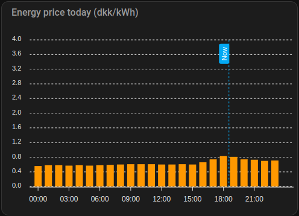
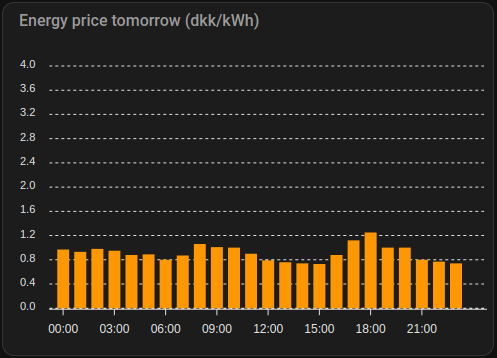

# Better Alternative

As the developer of this integration I would suggest using [MTrab/energidataservice](https://github.com/MTrab/energidataservice). Energidataservice also works with NRGI in addition to other providers. It offeres more options and is more actively maintained. This integration only has a subset of the features that Energidataservice has to offer.

# NRGI integration for Home Assistant
**This integration is not affiliated with NRGI.**

NRGI is a danish energy company that provides electricity and gas to private and business customers. The company acts like a Distribution System Operator (DSO) and is responsible for the distribution of electricity and gas to the end customer.

## Variable rate API
NRGI offers a variable-rate tariff for electricity. The variable-rate can be used to reduce the electricity bill by using electricity when the price is low. The price can be found on the NRGI website here: https://nrgi.dk/privat/stroem/bliv-klogere-paa-stroem/foelg-timeprisen-paa-stroem.

This API lets you see the variable-rate prices for the next 48 hours. Which can be used to let you know when to use power hungry devices.


# Installation
### HACS (recommended)

This card is available in [HACS](https://hacs.xyz/) (Home Assistant Community Store).
<small>_HACS is a third party community store and is not included in Home Assistant out of the box._</small>

# Display in Lovelace

To display the variable-rate prices in Lovelace, you use the ApexCharts card. The ApexCharts card is a custom card that can be installed using HACS. The card can be found here: https://github.com/RomRider/apexcharts-card.

## Prices for today:



```yaml
type: custom:apexcharts-card
graph_span: 24h
header:
  title: Energy price today (dkk/kWh)
  show: true
span:
  start: day
now:
  show: true
  label: Now
apex_config:
  yaxis:
    min: 0
    max: 4 # If you want the y-axis to be fixed at 4 dkk/kWh
series:
  - entity: sensor.nrgi_price_dk1
    type: column
    data_generator: |
      return entity.attributes.raw_today.map((start, index) => {
        return [new Date(start["start"]).getTime(), start["value"]];
      });
```

## Prices for tomorrow:


```yaml
type: custom:apexcharts-card
graph_span: 24h
header:
  title: Energy price tomorrow (dkk/kWh)
  show: true
span:
  start: day
  offset: +1d # Used to offset the start of the graph by 1 day
now:
  show: true
  label: Now
apex_config:
  yaxis:
    min: 0
    max: 4 # If you want the y-axis to be fixed at 4 dkk/kWh
series:
  - entity: sensor.nrgi_price_dk1
    type: column
    data_generator: |
      return entity.attributes.raw_tomorrow.map((start, index) => {
        return [new Date(start["start"]).getTime(), start["value"]];
      });
```


# FAQ

**When can I see the prices for the next day?**

The prices for the next day is available at 15:00. This is when NRGI updates the prices for the next day.

**Which region should i pick?**

The region is the area where you live. `DK1`is west part of denmark and `DK2` is the east part of denmark.

*Source: [Energinet](https://energinet.dk/El/Systemydelser/Introduktion-til-Systemydelser/Oversigt-over-systemydelser/)*
